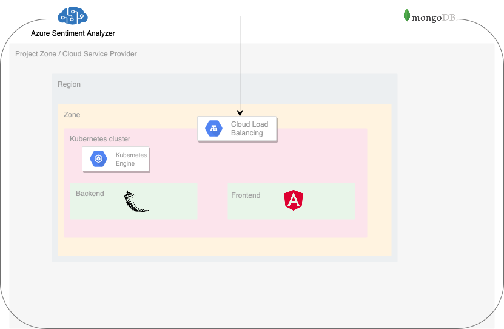

# Proyecto Aprendizaje automatico 
Enrique Lira Martinez A01023351<br/>
Emiliano Abascal Gurria A01023234<br/>
Antony Adrian Morales Rosas A01019582<br/>
Esmeralda Magdaleno Morales A01023086<br/>

# Enunciado del problema
En este pequeño proyecto, se implemento un modelo de regresión lineal  que predice el puntaje de un maestro individual al final del año. "score3" o la calificación final será nuestra etiqueta (salida) y el resto de las columnas serán nuestras características (entradas). Primero, exploraré los datos para ver si podemos comprender cuál es la historia detrás de los datos, este conjunto de datos contiene 28 preguntas que dividimos en 3 secciones, cada sección se conoce como un año escolar.

# Diagrama de Arquitectura



# Prerrequisitos
- `Docker`

# Quickstart
Guia para correr el programa de manera rápida

1. Clonar repositorio 
```bash 
git clone https://github.com/emilianoabascal/AprendizajeAutomaticoPrimeraEvaluacion
``` 
2. Ir hacia la carpeta
```bash 
cd AprendizajeAutomaticoPrimeraEvaluacion
``` 
3. Abrir docker

4. Run docker 
```bash 
docker-compose up 
``` 
5. Si se agregó un nuevo modulo de python a ´requirements.txt´:
```bash 
docker-compose build
``` 
y repetir el paso 4.

6. Buscar la dirreccion localhost o localhost:80 

7. Da click en el boton de train para entrenar el modelo con el dataset

8. Ingresa los valores a predecir 


# Uso
Esta es una explicación más detallada de los archivos y funciones principales que se usan.

## Archivos Python
### App.py: 
Este archivo es la API que se encarga de manejar las solicitudes que vienen del Front End.

Función `home()`:  Se utiliza para que la API envíe el archivo index.html.

Función `predict()`: Se utiliza para predecir los valores, la función se llama cuando se hace una solicitud HTTP que recive un JSON con la infomración introducida en el Front End, realiza las predicciones necesarias y regresa un resultado al cliente en un JSON.

Función `trainModel()`: Se utiliza para volver a entrenar el modelo, la función se llama cuando se hace una solicitud HTTP que recive un JSON con la infomración introducida en el Front End, realiza el entrenamiento y regresa una respuesta booleana para avisar al cliente si el entrenamiento fue exitoso o no.

### Train.py: Este archivo se encarga de realizar el entrenamiento del modelo.

función `Train()`: Importamos nuestro dataset, este conjunto de datos contiene 28 preguntas que dividimos en 3 secciones, cada sección se conoce como un año escolar este se divide en el conjunto de datos de entrenamiento y Prueba

Se ajusta el modelo de regresión lineal múltiple a nuestro conjunto de entrenamiento. Utilizamos el método de ajuste junto con los argumentos del método de ajuste, los cuales serán conjuntos de entrenamiento y luego creamos un modelo de archivo que contiene el modelo de entrenamiento.

## Archivos Front End (Angular):
### Frontend/

## Archivos Docker:
### Dockerfile-nginx: 
Dockerfile para el contenedor de NGINX.
### Dockerfile-flask: 
Dockerfile para el contenedor de FLASK.
### Dockerfile-angular: 
Dockerfile para el contenedor de Angular.
### app.conf: 
Archivo de configuración para el contenedor de NGINX, usado en Dockerfile-nginx.
### app.ini: 
Archivo de configuración para el contenedor de FLASK, usado en Dockerfile-flask.
### requirements.txt: 
Archivo que se utiliza para cargar las dependencias del contenedor de flask, por ejemplo ´numpy´.
### docker-compose.yml: 
Archivo Docker-Compose para levantar todos los contenedores necesarios (Flask, NGINX).

# Arquitectura

# Versión Final
## La versión final consistirá en lo siguiente:
- Login alumnos, para poder hacer las evaluaciones de sus clases.
- Login de profesores para poder acceder al dashboard de profesores
- Dashboard de profesores para ver las evaluaciones realizadas por los alumnos, asi como una predicción sobre cual es su futura calificación dependiendo de su actual evaluación.
- Capacidad de que los profesores puedan ver sus evaluaciones y palabras clave de cada una para poder recibir retroalimentación más efectiva.


